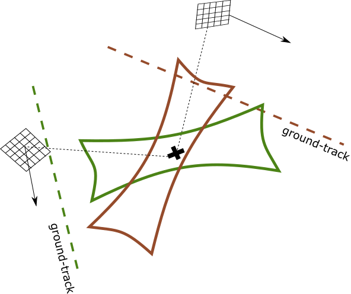
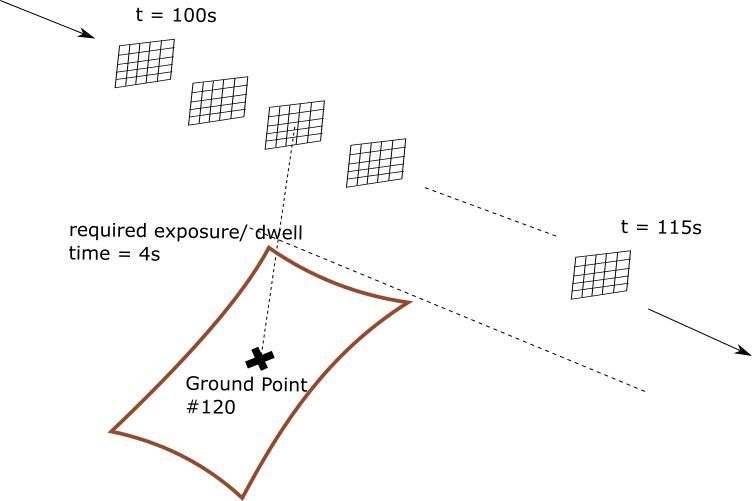

Miscellaneous
**************

This page describes miscellaneous concepts relating to the OrbitPy package.

.. todo:: OUTDATED. REVISION NECESSARY.

Issues with the above coverage calculation approach 
^^^^^^^^^^^^^^^^^^^^^^^^^^^^^^^^^^^^^^^^^^^^^^^^^^^^^

Current implementation works well only for:
   1. Instruments whose required observation time < propagation step-size.  For scanning type instruments 
      (like pushbroom sensors, stripmap SARs) this condition would be met. But this condition cannot be met for instruments 
      like Matrix imagers, radiometers which require the entire sensor FOV to be focused on the scene. 
   2. Whose FOV << FOR.

*First one is not realistic if the minimum exposure/ dwell time of instruments 
(required in radiometers) is to be considered. Second one is not realistic assumption for 
instruments having a wide-swath.*

The access file generated by the orbit and coverage is quite naive. It indicates if the ground-point can be accessed at some instant of time.
However, what we require are the imaging opportunities, where a imaging opportunity is defined as:

*Outlier grid-points:* The area around the grid-point should be able to be observed, not just the point. Not realistic for instruments with large FOV.

.. figure:: outlier_grid_points.png
    :scale: 75 %
    :align: center

    Issue of the outlier grid-points

Common issues:
==============

Issue
^^^^^^

* The area around the ground-point is not the same at each observation, especially for rectangular FOV sensors.

    Issue of the different observation areas when observation is made with footprint aligned to the ground-track.

Unclassified 
========================

With respect to integration in DSHIELD, the outputs/ functions of the package are used by other modules
of DSHIELD as follows:

.. csv-table:: Integration to other modules
    :header: "Data output", "the other module"
    :widths: 20, 20

    "Satellite States, Grid Points", "ACS module"
    "Intersatellite comms", "Comm Module"
    "Ground-station comms", "Ground module"
    "Access Opps with Observation quality", "Planner"

The input to the first three items is straightforward and can be used directly from the current implementation. The last item
however has issues. The raw access outputs are naive, and need to be filtered, post-processed to imaging opportunities (**raw access vs imaging opps**).     

Issue #1
^^^^^^^^
Consider a 5 second mission, the desired output from the Orbits to the Planner would be as follows:

.. code-block:: bash

    Time, (Grid-points, Observation Quality)
    1,    (10,2) (45,1) (100,1) (210,4) 
    2,    (10,3) (45,2) (100,2) (210,3) 
    3,    (10,4) (45,3) (100,3) (210,2) 
    4,    (10,3)        (100,4) (210,1) 
    5,    (10,1)        (100,5)  

Where a observation is defined as taking an image/ reading around the respective ground-point:

.. figure:: valid_vs_invalid_obs.png
    :scale: 75 %
    :align: center

    Valid vs Invalid observations

In order to deal with the above issue, the observation is deemed to be made with the pointing axis pointed to the GP
(and hence the missle of the observation). While this flows naturally when calculating coverage from pointing-options,
it is not natural for the case of coverage calculated from grid-points. See :ref:`correction_of_access_files`.

Issue #2
^^^^^^^^
A similar issue exists in the time domain:

.. code-block:: bash

    Time,Access,Imaging Opp
    98,No, No     
    99,No, No   
    100,Yes, No   
    101,Yes, No   
    102,Yes, No
    103,Yes, Yes iff t= 104, are free
    104,Yes, Yes iff t= 103, 105 are free
    105,Yes, Yes iff t=103, 104, 106 are free
    .,.,,
    .,.,,
    .,.,,
    .,.,,
    115, Yes,No
    116, No,No

    Valid vs Invalid obs times

To deal with the above issue, a constraint condition such as that shown in the table is implicit in the provided imaging oppurtunities
table.

