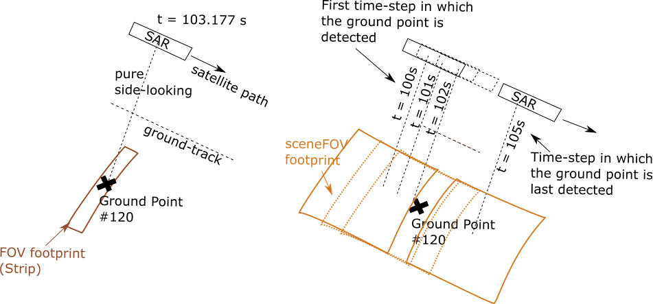

``orbitpy.coveragecalculator`` --- Coverage Calculator
===========================================================

Description
^^^^^^^^^^^^^

Module providing classes and functions to handle coverage related calculations. Factory method pattern is used for initializing the coverage calculator 
object (please see :ref:`module_constellation` for details). The module provides for three types of coverage calculations which are described in detail below.
Users may additionally define their own coverage calculator classes adherent to the same interface functions 
(``from_dict(.)``, ``to_dict(.)``, ``execute(.)``, ``__eq__(.)``) as in any of the built in coverage calculator classes.

.. _grid_cov_desc:

*GRID COVERAGE* 
----------------

The *GRID COVERAGE* type of coverage calculation involves finding the access-times of a spacecraft over a region represented by a grid. Each ``GridCoverage`` object is specific to 
a particular grid and spacecraft. The class instance is initialized using the grid object, spacecraft object and path to a data file containing the satellite propagated orbit-states. 
The format of the input data file of the spacecraft states is the same as the format of the output data file of the 
:class:`orbitpy.propagator` module (see :ref:`module_propagator`). The states must be of the type ``CARTESIAN_EARTH_CENTERED_INERTIAL``.

``GridCoverage.execute`` function
..................................

The coverage calculation can be executed using the ``execute(.)`` function. The instrument (in the spacecraft) and the mode of the instrument can be specified 
by means of their respective identifiers (in the ``instru_id``, ``mode_id`` input arguments). If not specified, the first instrument in the list of spacecraft's instruments, the first mode of the instrument (see the docs of :class:`instrupy.base.Instrument`)
in the list of modes of the instrument shall be selected. 

Coverage is calculated for the period over which the input spacecraft propagated states are available. The time-resolution of the coverage calculation is the same as the time resolution at which the spacecraft states are available.
Note that the sceneFOV of an instrument (which may be the same as the instrument FOV) is used for coverage calculations unless it has been specified to use the field-of-regard (using the ``use_field_of_regard`` input argument).

The ``mid_access_only`` input argument allows you to specify whether you want to keep only the access times that occur in the middle of a continuous access interval.
E.g. If the access takes place at time-indices 450, 451, 452, 453, 454, and if the ``mid_access_only`` flag is specified to be true, then only the access time-index = 452 is written
in the results.
Please see :ref:`correction_of_access_files` for situations when the ``mid_access_only`` flag would need to be set true.

The ``out_file_access`` input argument is 
used to specify the filepath (with filename) at which the results are to be written.

Three coverage methods (relevant for the case of sensor FOVs described by spherical-polygon vertices and Rectangular FOVs) can be 
specified: (1) ``DirectSphericalPIP`` or (2) ``ProjectedPIP`` or (3) ``RectangularPIP``. 
Default method is ``DirectSphericalPIP``.
The ``DirectSphericalPIP`` method is based on a point in spherical polygon algorithm described in the article: 
*R. Ketzner, V. Ravindra and M. Bramble, 'A Robust, Fast, and Accurate Algorithm for Point in Spherical Polygon Classification with Applications in Geoscience and Remote Sensing', Computers and Geosciences, accepted.*

A ``CoverageOutputInfo`` object containing meta-info about the results is returned at the end of execution of the function.

.. _grid_coverage_output_file_format:

Output data file format
.........................

The output of executing the coverage calculator is a csv data file containing the access data.

*  The first row contains the coverage calculation type.
*  The second row containing the mission epoch in Julian Day UT1. The time (index) in the state data is referenced to this epoch.
*  The third row contains the time step-size in seconds. 
*  The fourth row contains the duration (in days) for which coverage calculation is executed.
*  The fifth row contains the columns headers and the sixth row onwards contains the corresponding data. 

Note that time associated with a row is:  ``time = epoch (in JDUT1) + time-index * time-step-size (in secs) * (1/86400)`` 

Description of the columns headers and data is given below:

.. csv-table:: Coverage data description
      :header: Column, Data type, Units, Description
      :widths: 10,10,10,30

      time index, int, , Access time-index.
      GP index, int, , Grid-point index.
      lat [deg], float, degrees, Latitude corresponding to the GP index.
      lon [deg], float, degrees, Longitude corresponding to the GP index.

.. _pointing_opt_cov_desc:

*POINTING OPTIONS COVERAGE*
----------------------------

This type of coverage calculations is possible for an instrument (on a spacecraft) with a set of pointing-options.
A pointing-option refers to orientation of the instrument in the nadir-pointing frame. The set of pointing-options 
represent all the possible orientations of the instrument due to maneuverability of the instrument and/or satellite-bus.
The ground-locations for each pointing-option, at each propagation time-step is calculated as the coverage result.

The class instance is initialized using the spacecraft object and path to a data file containing the satellite propagated orbit-states. 
The format of the input data file of the spacecraft states is the same as the format of the output data file of the 
:class:`orbitpy.propagator` module (see :ref:`module_propagator`). The states must be of the type ``CARTESIAN_EARTH_CENTERED_INERTIAL``.

``PointingOptionsCoverage.execute`` function
...............................................

The coverage calculation can be executed using the ``execute(.)`` function. The instrument and the mode of the instrument (in the spacecraft) can be specified 
by means of their respective identifiers (in the ``instru_id``, ``mode_id`` input arguments). If not specified, the first instrument in the list of spacecraft's instruments, the first mode of the instrument (see the docs of :class:`instrupy.base.Instrument`)
in the list of modes of the instrument shall be selected.
A ``CoverageOutputInfo`` object containing meta-info about the results is returned at the end of execution of the function.

.. _pointing_options_coverage_output_file_format:

Output data file format
.........................

The output of executing the coverage calculator is a csv data file containing the access data.

*  The first row contains the coverage calculation type.
*  The second row containing the mission epoch in Julian Day UT1. The time (index) in the state data is referenced to this epoch.
*  The third row contains the time-step size in seconds. 
*  The fourth row contains the duration (in days) for which coverage calculation is executed.
*  The fifth row contains the columns headers and the sixth row onwards contains the corresponding data. 

Note that time associated with a row is:  ``time = epoch (in JDUT1) + time-index * time-step-size (in secs) * (1/86400)`` 

Description of the columns headers and data is given below:

.. csv-table:: Coverage data description
      :header: Column, Data type, Units, Description
      :widths: 10,10,10,30

      time index, int, , Access time-index.
      pnt-opt index, int, , "Pointing options index. The indexing starts from 0, where 0 is the first pointing-option in the list of instrument pointing-options."
      lat [deg], float, degrees, Latitude of accessed ground-location.
      lon [deg], float, degrees, Longitude of accessed ground-location.

.. _pointing_options_with_grid_coverage_output_file_format:

*POINTING OPTIONS WITH GRID COVERAGE*
--------------------------------------

This type of coverage calculations is similar to the :ref:`grid_cov_desc`, except that the coverage calculations are carried out for the list of pointing-options
(see :ref:`pointing_opt_cov_desc`) available for an instrument. 

``PointingOptionsWithGridCoverage.execute`` function
.......................................................

The function behavior is similar to the ``execute`` function of the ``GridCoverage`` object. Coverage calculations are performed for a specific instrument and mode,
and the results are written out for separately for each pointing-option of the instrument/mode. 
A key difference is that only the scene-field-of-view of the instrument is considered (no scope to use field-of-regard) in the coverage calculation. 

Output data file format
.........................

The output of executing the coverage calculator is a csv data file containing the access data.

*  The first row contains the coverage calculation type.
*  The second row containing the mission epoch in Julian Day UT1. The time (index) in the state data is referenced to this epoch.
*  The third row contains the time-step size in seconds. 
*  The fourth row contains the duration (in days) for which coverage calculation is executed.
*  The fifth row contains the columns headers and the sixth row onwards contains the corresponding data. 

Note that time associated with a row is:  ``time = epoch (in JDUT1) + time-index * time-step-size (in secs) * (1/86400)`` 

Description of the columns headers and data is given below:

.. csv-table:: Coverage data description
      :header: Column, Data type, Units, Description
      :widths: 10,10,10,30

      time index, int, , Access time-index.
      pnt-opt index, int, , "Pointing options index. The indexing starts from 0, where 0 is the first pointing-option in the list of instrument pointing-options."
      GP index, int, , Grid-point index.
      lat [deg], float, degrees, Latitude corresponding to the GP index.
      lon [deg], float, degrees, Longitude corresponding to the GP index.

.. _correction_of_access_files:

*Correction* of access files for purely side-looking instruments with narrow along-track FOV
----------------------------------------------------------------------------------------------------
In case of purely side-looking instruments with narrow-FOV (eg: SARs executing Stripmap operation mode), the access to a grid-point takes place
when the grid-point is seen with no squint angle and the access is almost instantaneous (i.e. access duration is very small). 
The coverage calculations is carried out with the corresponding instrument scene-field-of-view or field-of-regard (built using the scene-field-of-view) 
(see :code:`instrupy` package documentation). 
If the instrument FOV is to be used for coverage calculations, a *very very* small time step-size would need to be used which to impractically leads to long computation time.

The access files in general list rows of access-time, ground-points, and thus independent access opportunities for the instrument
when the scene-field-of-view / field-of-regard is used for coverage calculations. 
If the generated access files from the these coverage calculations of a purely side-looking, narrow along-track FOV instrument is
interpreted in the same manner, it would be erroneous.

Thus the generated access files are then *corrected* to show access only at approximately (to the nearest propagation time-step) 
the middle of the access interval. 
This should be coupled with the required scene-scan-duration (from scene-field-of-view) to get complete information about the access. 

For example, consider a SAR instrument pointing sideways as shown in the figure below. The along-track FOV is narrow
corresponding to narrow strips, and a scene is built from concatenated strips. A SceneFOV is associated with the SAR and is used for access 
calculation over the grid point shown in the figure. Say the propagation time-step is 1s as shown in the figure. An access interval between
t=100s to t=105s is registered. However as shown the actual access takes place over a small interval of time at t=103.177s. 

An approximation can be applied (i.e. correction is made) that the observation time of the ground point is at the middle of the access
interval as calculated using the SceneFOV, rounded of to the nearest propagation time, i.e. :math:`t= 100 + ((105-100)/2) % 1 = 103s`. The state 
of the spacecraft at :math:`t=103s` and access duration corresponding to the instrument FOV (note: *not* the sceneFOV) (can be determined analytically) 
is to be used for the data-metrics calculation.

.. warning:: The correction method is to be used only when the instrument access-duration (which is determined from the instrument FOV) is smaller 
            than the propagation time step (which is determined from the sceneFOV or FOR).

*SPECULAR COVERAGE* 
--------------------

The *SPECULAR COVERAGE* type of coverage calculation involves calculation of specular points/regions of a receiver spacecraft (with reflectometer as the instrument).
Each ``SpecularCoverage`` object is specific to a receiver spacecraft, list of source (transmitter) spacecrafts and an (optional) grid.
Specular points at each propagation time step are calculated between the receiver spacecraft and all the source spacecrafts. 
If a grid is specified, the set of grid points falling within a circular region (of user-specified diameter) about the specular point, is also calculated during the coverage execution.

The class instance is initialized using the receiver and source (>=1) spacecraft objects and path to the data files containing the propagated orbit-states of the spacecrafts.
The format of the input data file of the spacecraft states is the same as the format of the output data file of the 
:class:`orbitpy.propagator` module (see :ref:`module_propagator`). The states must be of the type ``CARTESIAN_EARTH_CENTERED_INERTIAL``.
In the state files, the epoch, propagation time resolution, must be the same across all the spacecrafts (receiver and source).
A grid object may also be specified during the class instantiation.

``SpecularCoverage.execute`` function
.......................................

The coverage calculation can be executed using the ``execute(.)`` function. The instrument (in the spacecraft) and the mode of the instrument can be specified 
by means of their respective identifiers (in the ``instru_id``, ``mode_id`` input arguments). If not specified, the first instrument in the list of spacecraft's instruments, the first mode of the instrument (see the docs of :class:`instrupy.base.Instrument`)
in the list of modes of the instrument shall be selected. Note that the sceneFOV of an instrument (which may be the same as the instrument FOV) is used for coverage calculations.
If no instrument present in spacecraft the entire horizon as seen by the receiving satellite is considered for the coverage calculations (however this does not work when grid based calculations are required, see the TODO below). 

The transmitter spacecraft is assumed to transmit the RF signal over it's entire visible horizon.

Coverage is calculated for the period over which the receiver, source spacecraft propagated states are available. 
The time-resolution of the coverage calculation is the same as the time resolution at which the spacecraft states are available.

If a grid has been specified (during the instantiation by the ``grid`` instance variable), and the diameter of the specular region has been specified (through the ``specular_region_dia`` input parameter),
then the grid points which are present within the specular region are found and written in the file specified by the ``out_file_grid_access`` parameter. The specular region is 
approximated to be circular in shape with the calculated specular point as the center, and the diameter specified by the ``specular_region_dia`` input parameter.

The ``mid_access_only`` input argument allows you to specify whether you want to keep only the access times that occur in the middle of a continuous access interval.

In case of sensor FOVs described by spherical-polygon vertices or Rectangular FOVs, a ``method`` can be specifies which specifies the method to be used to:

*     evaluate if a specular location is within the sensor FOV or not and,
*     for grid based calculations 

Refer to the ``execute`` function of the ``GridCoverage`` object for description of available methods.

.. todo:: When grid is specified, the sensor **must** be present, else a `NotImplementedError` is thrown. Modify this behaviour so 
          that the coverage calculations with grid can be carried out considering the entire horizon to be within the satellite FOV.

The figure below is a rough flowchart of the steps involved in the specular coverage for a receiver, source spacecraft pair:

The ``out_file_specular`` and ``out_file_grid_access`` input arguments are used to specify the filepaths (with filename) at which the results are to be written.

A ``CoverageOutputInfo`` object containing meta-info about the results is returned at the end of execution of the function.

.. _specular_coverage_output_file_format:

Output data file format
.........................

The output of executing the coverage calculator is a csv data file containing the specular locations and another csv file containting the grid points 
falling within the specular region (if a grid and the specular region diameters have been specified).

The csv file containing the specular locations has the following format:

*  The first row contains the coverage calculation type.
*  The second row containing the mission epoch in Julian Day UT1. The time (index) in the state data is referenced to this epoch.
*  The third row contains the time-step size in seconds.
*  The fourth row contains the duration (in days) for which coverage calculation is executed.
*  The fifth row contains the columns headers and the sixth row onwards contains the corresponding data. 

Note that time associated with a row is: ``time = epoch (in JDUT1) + time-index * time-step-size (in secs) * (1/86400)`` 

Description of the coverage data is given below:

.. csv-table:: Coverage data description
      :header: Column, Data type, Units, Description
      :widths: 10,10,10,30

      time index, int, , Access time-index.
      source id, int/str, , Source spacecraft identifier.
      lat [deg], float, degrees, Latitude of specular point.
      lon [deg], float, degrees, Longitude of specular point.

The csv file containing the grid access information has the following format:

*  The first row contains the coverage calculation type.
*  The second row containing the mission epoch in Julian Day UT1. The time (index) in the state data is referenced to this epoch.
*  The third row contains the time-step size in seconds. 
*  The fourth row contains the duration (in days) for which coverage calculation is executed.
*  The fifth row contains the columns headers and the sixth row onwards contains the corresponding data. 

Note that time associated with a row is:  ``time = epoch (in JDUT1) + time-index * time-step-size (in secs) * (1/86400)`` 

Description of the coverage data is given below:

.. csv-table:: Coverage data description
      :header: Column, Data type, Units, Description
      :widths: 10,10,10,30

      time index, int, , Access time-index.                    
      source id, int/str, , Source spacecraft identifier.
      GP index, int, , Grid-point index.
      lat [deg], float, degrees, Latitude corresponding to the GP index.
      lon [deg], float, degrees, Longitude corresponding to the GP index.

Examples
^^^^^^^^^

1. *GRID COVERAGE example 1*
   
   The following snippet of code initializes and executes coverage calculation for a spacecraft in an equatorial orbit, and a grid about the
   equator. The spacecraft is aligned to the nadir-pointing frame (:class:`instrupy.util.ReferenceFrame.NADIR_POINTING`) and the instrument in turn is
   aligned to the spacecraft body frame (:class:`instrupy.util.ReferenceFrame.SC_BODY_FIXED`). The access data shows the grid-points accessed at every time tick
   of the mission. The interval between the time-ticks is equal to the propagation step-size which here is 2 seconds.

   .. code-block:: python

         from orbitpy.util import OrbitState, Spacecraft, SpacecraftBus
         from orbitpy.propagator import J2AnalyticalPropagator
         from orbitpy.coveragecalculator import GridCoverage
         from orbitpy.grid import Grid
         from instrupy.base import Instrument
         import os
         
         out_dir = os.path.dirname(os.path.realpath(__file__))
         
         # initialize J2 analytical propagator with 2 secs propagation step-size
         j2_prop = J2AnalyticalPropagator.from_dict({"@type": 'J2 ANALYTICAL PROPAGATOR', 'stepSize':2} )
         
         # initialize orbit (initial state of the satellite)
         orbit = OrbitState.from_dict({"date":{"@type":"GREGORIAN_UT1", "year":2018, "month":5, "day":26, "hour":12, "minute":0, "second":0},
                              "state":{"@type": "KEPLERIAN_EARTH_CENTERED_INERTIAL", "sma": 6378+500, "ecc": 0.001, "inc": 0, "raan": 20, "aop": 0, "ta": 120}
                              })
         bus = SpacecraftBus.from_dict({"orientation":{"referenceFrame": "NADIR_POINTING", "convention": "REF_FRAME_ALIGNED"}}) # bus is aligned to the NADIR_POINTING frame.
         instru = Instrument.from_json({"@type": "Basic Sensor","fieldOfViewGeometry": {"shape": "circular", "diameter":30}, 
                                       "orientation": {"referenceFrame": "SC_BODY_FIXED", "convention": "REF_FRAME_ALIGNED"}}) # instrument is aligned to the bus
         # spacecraft with 1 instrument
         sc = Spacecraft(orbitState=orbit, spacecraftBus=bus, instrument=instru)
         
         state_cart_file = os.path.dirname(os.path.realpath(__file__)) + '/cart_state.csv'
         
         # execute the propagator for duration of 0.1 days 
         j2_prop.execute(sc, None, state_cart_file, None, duration=0.1) 
         
         # make the Grid object
         grid = Grid.from_dict({"@type": "autogrid", "@id": 1, "latUpper":25, "latLower":-25, "lonUpper":180, "lonLower":-180, "gridRes": 2})
         
         # set output file path
         out_file_access = out_dir + '/access.csv'
         
         # run the coverage calculator
         cov_cal = GridCoverage(grid=grid, spacecraft=sc, state_cart_file=state_cart_file)
         out_info = cov_cal.execute(instru_id=None, mode_id=None, use_field_of_regard=False, out_file_access=out_file_access, mid_access_only=False, method='ProjectedPIP')
         
         access.csv
         -----------
         GRID COVERAGE
         Epoch [JDUT1] is 2458265.0
         Step size [s] is 2.0
         Mission Duration [Days] is 0.1
         time index,GP index,lat [deg],lon [deg]
         0,4303,0.0,76.0
         1,4303,0.0,76.0
         2,4303,0.0,76.0
         3,4303,0.0,76.0
         4,4303,0.0,76.0
         5,4303,0.0,76.0
         6,4303,0.0,76.0
         7,4303,0.0,76.0
         7,4304,0.0,78.0
         8,4303,0.0,76.0
         8,4304,0.0,78.0
         9,4303,0.0,76.0
         9,4304,0.0,78.0
         10,4303,0.0,76.0
         10,4304,0.0,78.0
         11,4304,0.0,78.0
         12,4304,0.0,78.0
         ...
   
   In below snippet the ``mid_access_only`` flag is set to ``True`` instead of ``False``. Observe the difference in the output access data between the above result
   and the below result. In the below result only access at the middle of the access time-interval is shown. E.g. The very-first access to the GP 4303 is from time-index = 0 to 10 
   and the mid-interval access is at time-index = 5.

   .. code-block:: python

      out_info = cov_cal.execute(instru_id=None, mode_id=None, use_field_of_regard=False, out_file_access=out_file_access, mid_access_only=True, method='ProjectedPIP')

      access.csv
      -----------
      GRID COVERAGE
      Epoch [JDUT1] is 2458265.0
      Step size [s] is 2.0
      Mission Duration [Days] is 0.1
      time index,GP index,lat [deg],lon [deg]
      5,4303,0.0,76.0
      17,4304,0.0,78.0
      34,4305,0.0,80.0
      51,4306,0.0,82.0
      ...

2. *GRID COVERAGE example 2*
   
   In the below snippet, the satellite is equipped with two instruments. The second instrument, and second mode is selected for
   coverage calculation. The ``use_field_of_regard`` flag is set true to indicate that the field-of-regard should be considered for the coverage calculation.
   Note that in absence of the ``orientation`` specifications for the ``SpacecraftBus`` object, the default is assumed to be aligned to the nadir-pointing frame.
   In case of the instrument, the default orientation is alignment to the spacecraft bus. Since the ``method`` is not specified, the default method ``DirectSphericalPIP`` is used. 

   .. code-block:: python

      from orbitpy.util import OrbitState, Spacecraft, SpacecraftBus
      from orbitpy.propagator import J2AnalyticalPropagator
      from orbitpy.coveragecalculator import GridCoverage
      from orbitpy.grid import Grid
      from instrupy.base import Instrument
      import os

      out_dir = os.path.dirname(os.path.realpath(__file__))

      j2_prop = J2AnalyticalPropagator.from_dict({"@type": 'J2 ANALYTICAL PROPAGATOR', 'stepSize':2} )

      orbit = OrbitState.from_dict({"date":{"@type":"GREGORIAN_UT1", "year":2018, "month":5, "day":26, "hour":12, "minute":0, "second":0},
                        "state":{"@type": "KEPLERIAN_EARTH_CENTERED_INERTIAL", "sma": 6378+500, "ecc": 0.001, "inc": 0, "raan": 20, "aop": 0, "ta": 120}
                        })
      bus = SpacecraftBus.from_dict({}) 
      instru1= Instrument.from_json({"@type": "Basic Sensor","fieldOfViewGeometry": {"shape": "circular", "diameter":30}, "@id": "A"}) 
      instru2 = Instrument.from_json({"@type": "Basic Sensor","fieldOfViewGeometry": {"shape": "Rectangular", "angleHeight": 10, "angleWidth": 5},
                                    "mode":[{"@id":1, "maneuver":{"maneuverType": "CIRCULAR", "diameter":10}}, 
                                             {"@id":2, "maneuver":{"maneuverType": "SINGLE_ROLL_ONLY", "A_rollMin":10, "A_rollMax":35}}],
                                    "@id": "B"})                             
      # spacecraft with 2 instruments
      sc = Spacecraft(orbitState=orbit, spacecraftBus=bus, instrument=[instru1, instru2])

      state_cart_file = os.path.dirname(os.path.realpath(__file__)) + '/cart_state.csv'

      # execute the propagator for duration of 0.1 days 
      j2_prop.execute(sc, None, state_cart_file, None, duration=0.1) 

      # make the Grid object
      grid = Grid.from_dict({"@type": "autogrid", "@id": 1, "latUpper":25, "latLower":-25, "lonUpper":180, "lonLower":-180, "gridRes": 2})

      # set output file path
      out_file_access = out_dir + '/access.csv'

      # run the coverage calculator
      cov_cal = GridCoverage(grid=grid, spacecraft=sc, state_cart_file=state_cart_file)
      out_info = cov_cal.execute(instru_id="B", mode_id=2, use_field_of_regard=True, out_file_access=out_file_access, mid_access_only=True) # select instru B, mode 2

      access.csv
      -----------
      GRID COVERAGE
      Epoch [JDUT1] is 2458265.0
      Step size [s] is 2.0
      Mission Duration [Days] is 0.1
      time index,GP index,lat [deg],lon [deg]
      2,3943,2.0,76.0
      17,3944,2.0,78.0
      34,3945,2.0,80.0
      51,3946,2.0,82.0
      68,3947,2.0,84.0         

3. *POINTING OPTIONS COVERAGE example*

   In the below snippet, the satellite is equipped with two instruments. The second instrument is associated with pointing-options and is selected for
   coverage calculation. 

   .. code-block:: python

      from orbitpy.util import OrbitState, Spacecraft, SpacecraftBus
      from orbitpy.propagator import J2AnalyticalPropagator
      from orbitpy.coveragecalculator import PointingOptionsCoverage
      from instrupy.base import Instrument
      import os

      out_dir = os.path.dirname(os.path.realpath(__file__))

      j2_prop = J2AnalyticalPropagator.from_dict({"@type": 'J2 ANALYTICAL PROPAGATOR', 'stepSize':2} )

      orbit = OrbitState.from_dict({"date":{"@type":"GREGORIAN_UT1", "year":2018, "month":5, "day":26, "hour":12, "minute":0, "second":0},
                     "state":{"@type": "KEPLERIAN_EARTH_CENTERED_INERTIAL", "sma": 6378+500, "ecc": 0.001, "inc": 0, "raan": 20, "aop": 0, "ta": 120}
                     })
      bus = SpacecraftBus.from_dict({}) 
      instru1= Instrument.from_json({"@type": "Basic Sensor","fieldOfViewGeometry": {"shape": "circular", "diameter":10}, "@id": "A"}) 
      instru2 = Instrument.from_json({"@type": "Basic Sensor","fieldOfViewGeometry": {"shape": "circular", "diameter":5},
                                    "pointingOption":[{"referenceFrame": "NADIR_POINTING", "convention": "XYZ", "xRotation":0, "yRotation":2.5, "zRotation":0},
                                                      {"referenceFrame": "NADIR_POINTING", "convention": "XYZ", "xRotation":0, "yRotation":-2.5, "zRotation":0}],
                                    "@id": "B"})                             
      # spacecraft with 2 instruments
      sc = Spacecraft(orbitState=orbit, spacecraftBus=bus, instrument=[instru1, instru2])

      state_cart_file = os.path.dirname(os.path.realpath(__file__)) + '/cart_state.csv'

      # execute the propagator for duration of 0.1 days 
      j2_prop.execute(sc, None, state_cart_file, None, duration=0.1) 

      # set output file path
      out_file_access = out_dir + '/access.csv'

      # run the coverage calculator
      cov_cal = PointingOptionsCoverage(spacecraft=sc, state_cart_file=state_cart_file)
      out_info = cov_cal.execute(instru_id="B", mode_id=None, out_file_access=out_file_access, method='ProjectedPIP') # specify instrument "B"

      access.csv
      -----------
      POINTING OPTIONS COVERAGE
      Epoch [JDUT1] is 2458265.0
      Step size [s] is 2.0
      Mission Duration [Days] is 0.1
      time index,pnt-opt index,lat [deg],lon [deg]
      0,0,0.197,75.989
      0,1,-0.197,75.989
      1,0,0.197,76.108
      1,1,-0.197,76.108
      2,0,0.197,76.226
      ...

4. *POINTING OPTIONS WITH GRID COVERAGE example*
   
      In the below snippet, the satellite is equipped with two instruments. The second instrument with the pointing-options specifications is chosen for
      coverage calculations.  The ``mid_access_only`` input argument allows you to specify whether you want to keep only the access times that occur in the middle of a continuous access interval.
      The output csv file shows the grid-points accessed (if any) for each of the pointing-options at every time-step.
   
      .. code-block:: python

            from orbitpy.util import OrbitState, Spacecraft, SpacecraftBus
            from orbitpy.propagator import J2AnalyticalPropagator
            from orbitpy.coveragecalculator import PointingOptionsWithGridCoverage
            from orbitpy.grid import Grid
            from instrupy.base import Instrument
            import os
            
            out_dir = os.path.dirname(os.path.realpath(__file__))
            
            # initialize J2 analytical propagator with 2 secs propagation step-size
            j2_prop = J2AnalyticalPropagator.from_dict({"@type": 'J2 ANALYTICAL PROPAGATOR', 'stepSize':2} )
            
            # initialize orbit (initial state of the satellite)
            orbit = OrbitState.from_dict({"date":{"@type":"GREGORIAN_UT1", "year":2018, "month":5, "day":26, "hour":12, "minute":0, "second":0},
                              "state":{"@type": "KEPLERIAN_EARTH_CENTERED_INERTIAL", "sma": 6378+500, "ecc": 0.001, "inc": 0, "raan": 20, "aop": 0, "ta": 120}
                              })
            bus = SpacecraftBus.from_dict({"orientation":{"referenceFrame": "NADIR_POINTING", "convention": "REF_FRAME_ALIGNED"}}) # bus is aligned to the NADIR_POINTING frame.
            instru1= Instrument.from_json({"@type": "Basic Sensor","fieldOfViewGeometry": {"shape": "circular", "diameter":10}, "@id": "A"}) 
            instru2 = Instrument.from_json({"@type": "Basic Sensor","fieldOfViewGeometry": {"shape": "circular", "diameter":20},
                                          "pointingOption":[{"referenceFrame": "NADIR_POINTING", "convention": "XYZ", "xRotation":0, "yRotation":10, "zRotation":0},
                                                            {"referenceFrame": "NADIR_POINTING", "convention": "XYZ", "xRotation":0, "yRotation":-10, "zRotation":0}],
                                          "@id": "B"}) 
            # spacecraft with 1 instrument
            sc = Spacecraft(orbitState=orbit, spacecraftBus=bus, instrument=[instru1, instru2])
            
            state_cart_file = os.path.dirname(os.path.realpath(__file__)) + '/cart_state.csv'
            
            # execute the propagator for duration of 0.1 days 
            j2_prop.execute(sc, None, state_cart_file, None, duration=0.1) 
            
            # make the Grid object
            grid = Grid.from_dict({"@type": "autogrid", "@id": 1, "latUpper":45, "latLower":-45, "lonUpper":180, "lonLower":-180, "gridRes": 1})
            
            # set output file path
            out_file_access = out_dir + '/access.csv'
            
            # run the coverage calculator
            cov_cal = PointingOptionsWithGridCoverage(grid=grid, spacecraft=sc, state_cart_file=state_cart_file)
            out_info = cov_cal.execute(instru_id="B", mode_id=None, out_file_access=out_file_access, mid_access_only=True, method='RectangularPIP')

            access.csv
            -----------
            POINTING OPTIONS WITH GRID COVERAGE
            Epoch [JDUT1] is 2458265.0
            Step size [s] is 2.0
            Mission Duration [Days] is 0.1
            time index,pnt-opt index,GP index,lat [deg],lon [deg]
            2,1,28958,-1.0,75.71
            3,0,28599,1.0,76.0
            6,1,28959,-1.0,76.713
            8,0,28600,1.0,77.0
            ...

5. *SPECULAR COVERAGE example*
   
      The example shows calculation of specular points and also grid based access calculations involving three transmitter satellites (Navstar 79, 80 and 81),
      and a receiver satellite equipped with a 45 deg x 45 deg rectangular FOV sensor. Two files `test_specular_access.csv` and `test_grid_access.csv` are written.
      A 50km diameter is specified as the dimension of the specular region.

      .. code-block:: python

            from orbitpy.util import Spacecraft
            from orbitpy.propagator import J2AnalyticalPropagator
            from orbitpy.coveragecalculator import SpecularCoverage
            from orbitpy.grid import Grid
            import propcov
            import os

            out_dir = os.path.dirname(os.path.realpath(__file__))

            # initialize J2 analytical propagator with 60 secs propagation step-size
            j2_prop = J2AnalyticalPropagator.from_dict({"@type": 'J2 ANALYTICAL PROPAGATOR', 'stepSize':60} )

            # NAVSTAR 79
            navstar79_json = '{"name": "NAVSTAR-79", \
                        "spacecraftBus":{ "orientation":{"referenceFrame": "NADIR_POINTING", "convention": "REF_FRAME_ALIGNED"} \
                                          }, \
                        "orbitState": {"date":{"@type":"GREGORIAN_UT1", "year":2022, "month":5, "day":15, "hour":5, "minute":14, "second":35.273}, \
                                          "state":{"@type": "KEPLERIAN_EARTH_CENTERED_INERTIAL", "sma": 26560.726, "ecc": 0.00211560, "inc": 55.4987, "raan": 87.6401, "aop": 178.443, "ta": 346.190} \
                                          } , \
                        "@id": "navstar79" \
                        }'
            navstar79_state_fl =   out_dir + "/navstar79_state.csv"
            # NAVSTAR 80
            navstar80_json = '{"name": "NAVSTAR-80", \
                        "spacecraftBus":{ "orientation":{"referenceFrame": "NADIR_POINTING", "convention": "REF_FRAME_ALIGNED"} \
                                          }, \
                        "orbitState": {"date":{"@type":"GREGORIAN_UT1", "year":2022, "month":5, "day":15, "hour":17, "minute":58, "second":15.3}, \
                                          "state":{"@type": "KEPLERIAN_EARTH_CENTERED_INERTIAL", "sma": 26560.217, "ecc": 0.00185450, "inc": 54.5899, "raan": 271.4221, "aop": 184.7310, "ta": 336.981} \
                                          } , \
                        "@id": "navstar80" \
                        }'
            navstar80_state_fl =   out_dir +  "/navstar80_state.csv"
            # NAVSTAR 81
            navstar81_json = '{"name": "NAVSTAR-81", \
                        "spacecraftBus":{ "orientation":{"referenceFrame": "NADIR_POINTING", "convention": "REF_FRAME_ALIGNED"} \
                                          }, \
                        "orbitState": {"date":{"@type":"GREGORIAN_UT1", "year":2022, "month":5, "day":15, "hour":17, "minute":2, "second":22.300}, \
                                          "state":{"@type": "KEPLERIAN_EARTH_CENTERED_INERTIAL", "sma": 26559.327, "ecc": 0.00036260, "inc": 55.1689, "raan": 32.3671, "aop": 199.0483, "ta": 117.475} \
                                          } , \
                        "@id": "navstar81" \
                        }'
            navstar81_state_fl =   out_dir +  "/navstar81_state.csv"

            testsat_json = '{ "name": "testsat", \
                  "spacecraftBus":{"orientation":{"referenceFrame": "NADIR_POINTING", "convention": "REF_FRAME_ALIGNED"} \
                                    }, \
                  "orbitState": {"date":{"@type":"GREGORIAN_UT1", "year":2022, "month":5, "day":15, "hour":20, "minute":19, "second":26.748768}, \
                                    "state":{"@type": "KEPLERIAN_EARTH_CENTERED_INERTIAL", "sma": 7078.137, "ecc": 0.00151280, "inc": 34.9537, "raan": 47.2225, "aop": 162.3608, "ta": 197.700} \
                                    }, \
                  "instrument": {"@type":"Basic Sensor", "@id":"senA", \
                                  "orientation": {"referenceFrame": "SC_BODY_FIXED", "convention": "REF_FRAME_ALIGNED"}, \
                                  "fieldOfViewGeometry": {"shape": "RECTANGULAR", "angleHeight":45, "angleWidth":45}}, \
                  "@id": "testsat" \
                  }'
            testsat_state_fl = out_dir +  "/testsat_state.csv"

            navstar79 = Spacecraft.from_json(navstar79_json)
            navstar80 = Spacecraft.from_json(navstar80_json)
            navstar81 = Spacecraft.from_json(navstar81_json)
            testsat = Spacecraft.from_json(testsat_json)

            # execute propagator
            start_date = propcov.AbsoluteDate.fromGregorianDate(2022, 5, 15, 21 ,0, 0)
            duration = 1
            j2_prop.execute(spacecraft=navstar79, start_date=start_date, out_file_cart=navstar79_state_fl, duration=duration)
            j2_prop.execute(spacecraft=navstar80, start_date=start_date, out_file_cart=navstar80_state_fl, duration=duration)
            j2_prop.execute(spacecraft=navstar81, start_date=start_date, out_file_cart=navstar81_state_fl, duration=duration)
            j2_prop.execute(spacecraft=testsat, start_date=start_date, out_file_cart=testsat_state_fl, duration=duration)

            # set output file path
            out_file_specular = out_dir+'/test_specular_access.csv'
            out_file_grid_access = out_dir+'/test_grid_access.csv'
            # run the coverage calculator
            spec_cov = SpecularCoverage(rx_spc=testsat, rx_state_file=testsat_state_fl,
                                          tx_spc=[navstar79, navstar80, navstar81], tx_state_file=[navstar79_state_fl, navstar80_state_fl, navstar81_state_fl],
                                          grid=Grid.from_dict({"@type": "autogrid", "@id": 1, "latUpper":20, "latLower":-20, "lonUpper":180, "lonLower":-180, "gridRes": 0.125}))
            spec_cov.execute(instru_id=None, mode_id=None, out_file_specular=out_file_specular, specular_region_dia=50, out_file_grid_access=out_file_grid_access) # the 1st instrument and the 1st mode is selected.

            test_specular_access.csv
            ---------------------------------
            SPECULAR COVERAGE
            Epoch [JDUT1] is 2459715.375
            Step size [s] is 60.0
            Mission Duration [Days] is 1.0
            time index,source id,lat [deg],lon [deg]
            164,navstar79,13.483,201.964
            165,navstar79,15.202,204.583
            166,navstar79,16.872,207.26

            test_grid_access.csv
            ---------------------------------
            SPECULAR COVERAGE GRID ACCESS            
            Epoch [JDUT1] is 2459715.375
            Step size [s] is 60.0
            Mission Duration [Days] is 1.0
            time index,source id,GP index,lat [deg],lon [deg]
            164,navstar79,281132,13.625,-158.135
            164,navstar79,281133,13.625,-158.006
            164,navstar79,281134,13.625,-157.878
            ...

API
^^^^^

.. rubric:: Classes

.. autosummary::
   :nosignatures:
   :toctree: generated/
   :template: classes_template.rst
   :recursive:

   orbitpy.coveragecalculator.CoverageCalculatorFactory
   orbitpy.coveragecalculator.GridCoverage
   orbitpy.coveragecalculator.PointingOptionsCoverage
   orbitpy.coveragecalculator.PointingOptionsWithGridCoverage
   orbitpy.coveragecalculator.SpecularCoverage

.. rubric:: Functions

.. autosummary::
   :nosignatures:
   :toctree: generated/
   :template: functions_template.rst
   :recursive:

   orbitpy.coveragecalculator.helper_extract_coverage_parameters_of_spacecraft
   orbitpy.coveragecalculator.find_in_cov_params_list
   orbitpy.coveragecalculator.filter_mid_interval_access