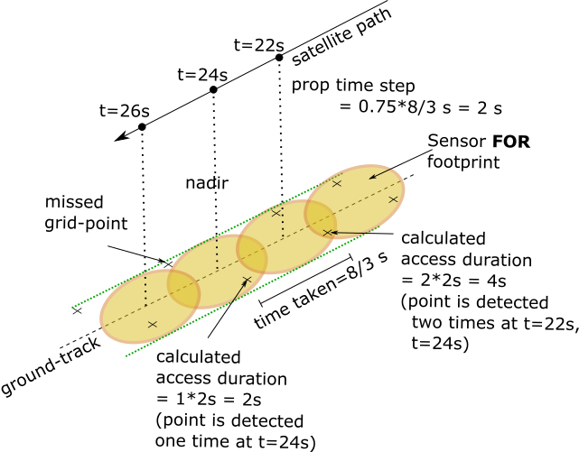

.. _module_propagator:

``orbit.propagator`` --- Propagator Module
===========================================

Description
^^^^^^^^^^^^^

Module providing classes and functions to handle orbit propagation. Factory method pattern is used for initializing the propagator 
object (please see :ref:`module_constellation` for details). The module provides for an J2 analytical propagator class (model) 
which has been validated with the STK J2 analytical propagator. Users may additionally define their own propagator classes
adherent to the same interface functions (``from_dict(.)``, ``to_dict(.)``, ``execute(.)``, ``__eq__(.)``) as in the in-built propagator class.

.. _propagated_state_file_format:

Output data file format
-------------------------

The output of executing the propagator is a csv data file containing the satellite states (Cartesian Earth centered inertial and/or Keplerian Earth centered inertial).

*  The first row specifies if the states are in ``CARTESIAN_EARTH_CENTERED_INERTIAL`` or ``KEPLERIAN_EARTH_CENTERED_INERTIAL`` reference frame.
*  The second row containing the mission epoch in Julian Day UT1. The time (index) in the state data is referenced to this epoch.
*  The third row contains the time-step size in seconds. 
*  The fourth row contains the mission duration in days.
*  The fifth row contains the columns headers and the sixth row onwards contains the corresponding data. 

Note that time associated with a row is:  ``time = epoch (in JDUT1) + time-index * time-step-size (in secs) * (1/86400)`` 

Description of the column headers and data (in either ``CARTESIAN_EARTH_CENTERED_INERTIAL`` or ``KEPLERIAN_EARTH_CENTERED_INERTIAL`` reference frame) is given below:

.. csv-table:: CARTESIAN_EARTH_CENTERED_INERTIAL state data description
   :header: Column, Data type, Units, Description
   :widths: 10,10,10,40

   time index, int, , Time-index
   x [km], float, km, X component of spacecraft position.
   y [km], float, km, Y component of spacecraft position.
   z [km], float, km, Z component of spacecraft position.
   vx [km/s], float, km per sec, X component of spacecraft velocity.
   vy [km/s], float, km per sec, Y component of spacecraft velocity.
   vz [km/s], float, km per sec, Z component of spacecraft velocity.

.. csv-table:: KEPLERIAN_EARTH_CENTERED_INERTIAL state data description
   :header: Column, Data type, Units, Description
   :widths: 10,10,5,40

   time index, int, , Time-index
   sma [km], float, km, Orbit semi-major axis dimension.
   ecc, float, , Orbit eccentricity
   inc [deg], float, degrees, Orbit inclination
   raan [deg], float, degrees, Orbit right ascension of ascending node
   aop [deg], float, degrees, Orbit argument of Perigee
   ta [deg], float, degrees, True Anomaly

The module also offers computation of an appropriate propagation time-step for list of satellites (considering the orbit sma and the sensor field-of-regard)
and an user-set *time-resolution factor* by using the ``compute_time_step(.)`` function. The propagation time step is calculated based on the time taken 
to cover the length (along-track) of the sensor field-of-**regard** footprint and a time-resolution factor (:code:`time_res_fac`) (default = 0.25). 
Smaller :code:`time_res_fac` implies higher precision in calculation of the access interval over a grid-point. 
Note that in case of sensors with circular FOV there is always a chance that grid-points are missed during the access calculations.

The field-of-regard is assumed to be oriented about the nadir (aligned to the ``NADIR_POINTING`` frame) and the calculated time-step is based on the 
resulting along-track footprint length. Only ``CIRCULAR`` and ``RECTANGULAR`` field-of-regard spherical geometry shapes are supported. In case of ``RECTANGULAR``
shaped spherical geometry note that the FOV/FOR angle-height would correspond to the along-track FOV/FOR.

   Illustration of possible inaccuracies due to a large time resolution factor (0.75 in above figure) during calculation of access intervals.   

.. todo:: Add additional propagator models (SGP4, etc) and also provide support to read-in propagated data from GMAT, STK.

Examples
^^^^^^^^^

1. Working with the J2 analytical propagator.

   The following snippet of code initializes and executes the orbit of a satellite. The propagation step-size
   is 15 secs and propagation duration is 0.25 days. The start date of propagation is equal to the date at which the spacecraft orbit-state is referenced
   Only the Keplerian states are produced since only the path to the Keplerian state output data file is specified. 
   The execution returns the ``PropagatorOutputInfo`` object which contains the metadata of the propagation.

   .. code-block:: python

         from orbitpy.util import OrbitState, Spacecraft
         from orbitpy.propagator import PropagatorFactory
         import os
         
         factory = PropagatorFactory()
         # initialize J2 analytical propagator with 15 secs propagation step-size (i.e. the interval at which the satellite states are produced) 
         specs = {"@type": 'J2 ANALYTICAL PROPAGATOR', 'stepSize':15 } 
         j2_prop = factory.get_propagator(specs)
         
         # initialize orbit (initial state of the satellite)
         orbit = OrbitState.from_dict({"date":{"dateType":"GREGORIAN_UTC", "year":2018, "month":5, "day":26, "hour":12, "minute":0, "second":0}, 
                        "state":{"stateType": "KEPLERIAN_EARTH_CENTERED_INERTIAL", "sma": 700, "ecc": 0.002, "inc": 98.8, "raan": 120, "aop": 10, "ta": 39} })
         # spacecraft with 1 instrument
         sc = Spacecraft(orbitState=orbit)
         out_file_kep = os.path.dirname(os.path.realpath(__file__)) + '/kep_state.csv' # path to the output file containing the Keplerian states
         out_info = j2_prop.execute(sc, None, None, out_file_kep, duration=0.25) # execute the propagator for duration of 0.25 days 
         print(out_info)
   
         >> PropagatorOutputInfo.from_dict({'@type': 'PropagatorOutputInfo', 'propagatorType': 'J2 ANALYTICAL PROPAGATOR', 
                  'spacecraftId': None, 'stateCartFile': None, 
                  'stateKeplerianFile': '/mnt/hgfs/Workspace/orbits/kep_state.csv', 
                  'startDate': 2458265.0, 'duration': 0.25, '@id': None})

         kep_state.csv
         --------------
         Satellite states as KEPLERIAN_EARTH_CENTERED_INERTIAL elements.
         Epoch [JDUT1] is 2458265.0
         Step size [s] is 15.0
         Mission Duration [Days] is 0.25
         time index,sma [km],ecc,inc [deg],raan [deg],aop [deg],ta [deg]
         0,700.0000000000002,0.0020000000000001046,98.8,119.99999999999999,10.000000000006276,38.99999999999376
         1,700.0000000000003,0.0020000000000001262,98.8,120.60429914109106,8.256106395436355,66.52753827588562
         ...
   
   In below snippet the start date of the propagation is different from the date at which the spacecraft orbit-state is referenced. 
   Also both the Cartesian and Keplerian states of the satellite are produced since both the output data filepaths are supplied to the executor.

   .. code-block:: python

         prop_start_date = OrbitState.date_from_dict({"dateType":"GREGORIAN_UTC", "year":2018, "month":5, "day":27, "hour":12, "minute":0, "second":0})
         j2_prop.execute(sc, prop_start_date, out_file_cart, out_file_kep, duration=0.25)

2. Propagation time-step calculation

   Computing time-step for a set of 2 satellites with 1 and 2 instruments respectively. Note that the first instrument has maneuverability
   and hence it's FOR is different from the FOV. (The FOR is considered in the propagation time-step calculations.)
   Output is in seconds.

   .. code-block:: python
         
      import orbitpy.propagator 
      from orbitpy.util import OrbitState, Spacecraft
      from instrupy import Instrument
      
      RE = 6378.137 # radius of Earth in kilometers
      instru1 = Instrument.from_json('{"@type": "Basic Sensor","fieldOfViewGeometry": {"shape": "Rectangular", "angleHeight": 10, "angleWidth": 5}, "maneuver":{"maneuverType": "CIRCULAR", "diameter":10}}')
      instru2 = Instrument.from_json('{"@type": "Basic Sensor","fieldOfViewGeometry": {"shape": "Rectangular", "angleHeight": 10, "angleWidth": 5}}')
      instru3 = Instrument.from_json('{"@type": "Basic Sensor","fieldOfViewGeometry": {"shape": "Rectangular", "angleHeight": 10, "angleWidth": 15}}')
      
      orbit1 = OrbitState.from_dict({"date":{"dateType":"JULIAN_DATE_UT1", "jd":2459270.75},"state":{"stateType": "KEPLERIAN_EARTH_CENTERED_INERTIAL", "sma": RE+700, "ecc": 0.001, "inc": 0, "raan": 0, "aop": 0, "ta": 0}})
      orbit2 = OrbitState.from_dict({"date":{"dateType":"JULIAN_DATE_UT1", "jd":2459270.75},"state":{"stateType": "KEPLERIAN_EARTH_CENTERED_INERTIAL", "sma": RE+750, "ecc": 0.001, "inc": 30, "raan": 0, "aop": 0, "ta": 0}})
      
      sats = [Spacecraft(orbitState=orbit1, instrument=[instru1]), # list of 2 satellites with 1 and 2 instruments respectively
              Spacecraft(orbitState=orbit2, instrument=[instru2, instru3])]
      x = orbitpy.propagator.compute_time_step(sats, 0.125) # custom time resolution factor is chosen as 0.125
      
      print(x)
      
      >> 2.452774546516295
   
API
^^^^^

.. rubric:: Classes

.. autosummary::
   :nosignatures:
   :toctree: generated/
   :template: classes_template.rst
   :recursive:

   orbitpy.propagator.PropagatorFactory
   orbitpy.propagator.J2AnalyticalPropagator
   orbitpy.propagator.PropagatorOutputInfo

.. rubric:: Functions

.. autosummary::
   :nosignatures:
   :toctree: generated/
   :template: functions_template.rst
   :recursive:

   orbitpy.propagator.compute_time_step