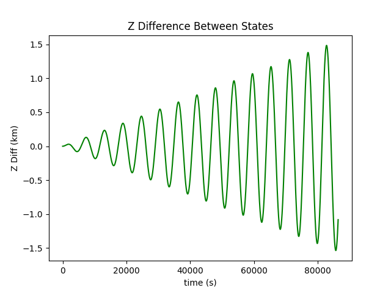
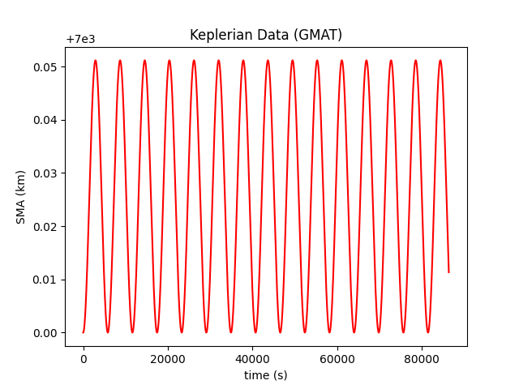
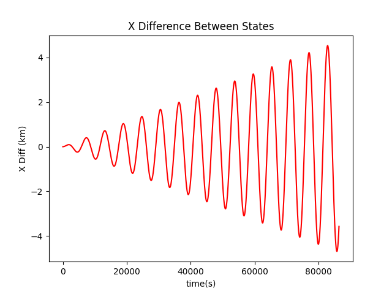
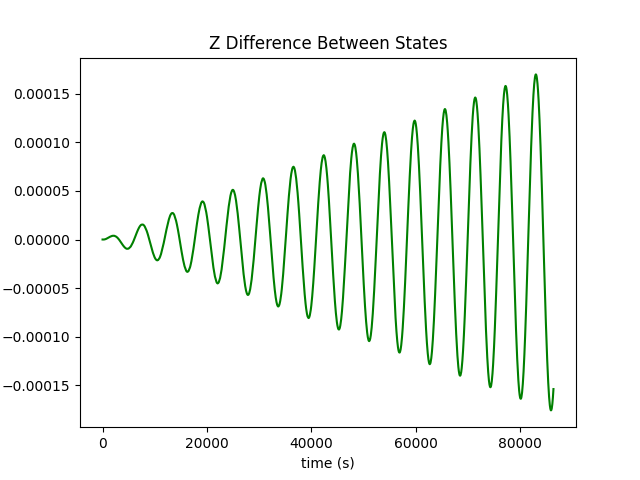
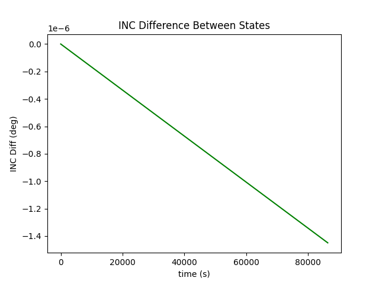
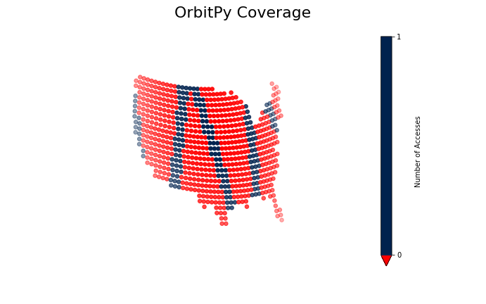
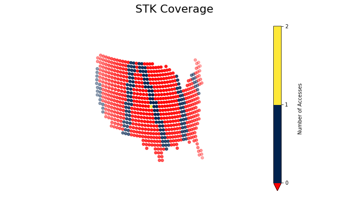
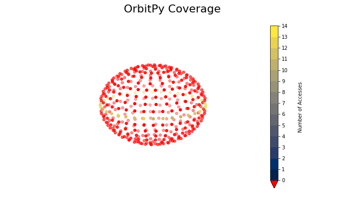
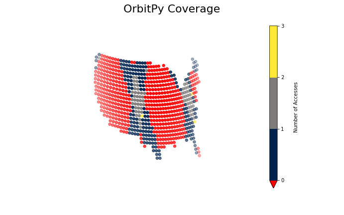

.. _validation:

Validation
*******************

About
=====

Core features of OrbitPy were validated against GMAT and STK, two industry standard mission design softwares. Although these tests are generated and run using Python's unittest module, it is important that they are not thought of as traditional unit tests. Since they test whole features of OrbitPy at once, any errors found in these tests would be difficult to tie to a particular algorithm or software feature. Furthermore, since STK in particular is a closed-source proprietary software, implementation details that differ from OrbitPy are difficult to quantify and predict.

The purpose of these tests is to provide a high-level 'sanity check' for OrbitPy, as well as a constant base of reference for future software revisions.

All of the files associated with these test can be found at :code:`tests/validation`. :code:`tests/validation/STK` contains the files used to generate STK truth data, while :code:`tests/validation/GMAT` contains the files used to generate GMAT truth data. After the test cases are run, the OrbitPy results can be found at :code:`tests/validation/temp`.

Test cases were set to pass or fail based on hard-coded difference values in the results from OrbitPy vs. the truth value from the reference software. The test cases all pass as of September 2020 on the master branch.

GMAT Tests
==========

GMAT Propagation Tests: Model
^^^^^^^^^^^^^^^^^^^^^^^^^^^^^

The propagation model was tested against GMAT's orbit propagation capabilities. GMAT's propagation settings were fine-tuned to match
OrbitPy's capabilities as closely as possible. This included using the eq2000 frame for propagation and output, limiting the gravity model
to only consideration of degree 2, order 0 perturbations (J2 only), changing the earth radius value to exactly match OrbitPy's, and
setting the min/max step size on the numerical propagator to 1 second, among other settings.

Due to certain unresolvable differences between GMAT and OrbitPy, it is impossible to match the outputs exactly. In particular, GMAT uses a numerical propagator, while OrbitPy uses an analytical model. OrbitPy's analytical model considers only secular
J2 perturbations, while GMAT considers all J2 (periodic and secular) perturbations. This is likely the biggest cause of difference between
the two outputs.

GMAT Propagation Tests: Input
^^^^^^^^^^^^^^^^^^^^^^^^^^^^^

The GMAT test cases were generated by propagating the following orbits for one day:

1.  * SMA: 7000
    * ECC: 0
    * INC: 0
    * RAAN: 0
    * AOP: 0
    * TA: 0
2.  * SMA: 7000
    * ECC: 0
    * INC: 1
    * RAAN: 1
    * AOP: 1
    * TA: 1
3.  * SMA: 7000
    * ECC: 0
    * INC: 90
    * RAAN: 180
    * AOP: 180
    * TA: 180
4.  * SMA: 7578.378
    * ECC: 0
    * INC: 45.7865
    * RAAN: 98.8797
    * AOP: 75.78089
    * TA: 277.789
5.  * SMA: 7578.378
    * ECC: 0
    * INC: 180
    * RAAN: 98.8797
    * AOP: 75.78089
    * TA: 277.789
6.  * SMA: 7000
    * ECC: 0
    * INC: 90
    * RAAN: 98.8797
    * AOP: 75.78089
    * TA: 277.789
7.  * SMA: 7000
    * ECC: 0
    * INC: 170
    * RAAN: 98.8797
    * AOP: 75.78089
    * TA: 277.789
8.  * SMA: 7000
    * ECC: 0
    * INC: 10
    * RAAN: 98.8797
    * AOP: 75.78089
    * TA: 277.789

Each of the test functions can be found in :code:`tests/validation/test_GMAT_propagation_OrbitPropCovGrid`. The numbers listed here correspond to the test function names (i.e orbit 1 is propagated in :code:`test_run_1`).

GMAT Propagation Tests: Analysis
^^^^^^^^^^^^^^^^^^^^^^^^^^^^^^^^

The initial position for each test came out to match exactly. However, the example plots below clearly illustrate the modelling differences between GMAT and OrbitPy. The results for the first test case (a 7000 km equatorial circular orbit, with all other orbital elements set to 0) 
expressed in cartesian coordinates show divergence.

.. figure:: ./plots/GMAT_01_X_Diff.png
	:scale: 75%
	:align: center

Notably, the Z position also diverges. An inclination is introduced in the GMAT propagation that remains at zero in the OrbitPy propagation. This is due to a periodic perturbation in inclination modeled in GMAT, but taken as zero in OrbitPy.

These additional periodic perturbations in the GMAT model can be more clearly seen when examining the keplerian elements. In particular, the semi-major axis, eccentricity, and inclination are subject to periodic purturbations not present in OrbitPy (for this OrbitPy test case, these values remained at zero throughout the simulation).

.. figure:: ./plots/GMAT_01_ECC.png
	:scale: 75%
	:align: center

.. figure:: ./plots/GMAT_01_INC.png
	:scale: 75%
	:align: center
	
For the sake of brevity, the GMAT results for the remaining tests are not shown here. Since STK was found to be a much better match for OrbitPy's model, the rest of the analysis on this page will focus on STK results.
	
STK Tests
=========

STK Propagation Tests: Model
^^^^^^^^^^^^^^^^^^^^^^^^^^^^

Due to the significant modelling differences between OrbitPy and GMAT, STK was used for the remaining test cases. STK was expected to match much more closely with GMAT, because STK has the option of using an analytical propagator which considers only secular perturbations in J2, just like OrbitPy. As with GMAT, the STK settings were matched as closely as possible with OrbitPy. The STK scenario file used to produce the data can be found at :code:`tests/validation/STK/test_STK_propagation/Test_01.sc`.

The STK test cases resulted in a much smaller difference than GMAT. Remaining differences are likely explained by a variety of small factors, such as floating point error and slight modelling differences. 

Test case were set to pass if the difference in each cartesian state was less than 6 km at every point along the orbit. The last three tests compared RAAN drift: these were set to pass if the difference in RAAN was less than .015 degrees at every point along the orbit.

STK Propagation Tests: Inputs
^^^^^^^^^^^^^^^^^^^^^^^^^^^^^

The STK test cases were generated by propagating the following orbits for one day:

1.  * SMA: 7000
    * ECC: 0
    * INC: 0
    * RAAN: 0
    * AOP: 0
    * TA: 0
2.  * SMA: 7000
    * ECC: 0
    * INC: 1
    * RAAN: 1
    * AOP: 1
    * TA: 1
3.  * SMA: 7000
    * ECC: 0
    * INC: 90
    * RAAN: 180
    * AOP: 180
    * TA: 180
4.  * SMA: 7578.378
    * ECC: 0
    * INC: 45.7865
    * RAAN: 98.8797
    * AOP: 75.78089
    * TA: 277.789
5.  * SMA: 7578.378
    * ECC: 0
    * INC: 180
    * RAAN: 98.8797
    * AOP: 75.78089
    * TA: 277.789
6.  * SMA: 7000
    * ECC: 0
    * INC: 90
    * RAAN: 98.8797
    * AOP: 75.78089
    * TA: 277.789
7.  * SMA: 7000
    * ECC: 0
    * INC: 10
    * RAAN: 98.8797
    * AOP: 75.78089
    * TA: 277.789
8.  * SMA: 7000
    * ECC: 0
    * INC: 170
    * RAAN: 98.8797
    * AOP: 75.78089
    * TA: 277.789

Each of the test functions can be found in :code:`tests/validation/test_STK_propagation_OrbitPropCovGrid`. The numbers listed here correspond to the test function names (i.e orbit 1 is propagated in :code:`test_run_1`).

STK Propagation Tests: Analysis
^^^^^^^^^^^^^^^^^^^^^^^^^^^^^^^

The results from all eight test cases are summarized in the table below:

.. list-table:: **Test Results**
   :header-rows: 1
   :stub-columns: 1
   
   * - 
     - 1
     - 2
     - 3
     - 4
     - 5
     - 6
     - 7
     - 8
   * - Max Difference (km)
     - 4.69
     - 4.68
     - 3.82
     - 3.33
     - 4.19
     - N/A
     - N/A
     - N/A
   * - Max Difference (deg)
     - N/A
     - N/A
     - N/A
     - N/A
     - N/A
     - .00000149
     - .00914
     - .00916
   
The results from the first test case, this time with STK data, are shown again below.

A difference in the Z positions is still introduced, although it is substantially smaller. For an unknown reason, the STK propagation also introduces a small inclination, although much less than GMAT.

The difference in the semi-major axis, eccentricity, and inclination are plotted below. The semi-major axis and inclination difference plots both exibit very small, random error, while the inclination plot shows a slightly larger, linearly increasing difference.

.. figure:: ./plots/STK_01_SMA_Diff.png
	:scale: 75%
	:align: center

.. figure:: ./plots/STK_01_ECC_Diff.png
	:scale: 75%
	:align: center

STK Coverage Tests: Model
^^^^^^^^^^^^^^^^^^^^^^^^^^^

The ground point access capabilities of OrbitPy's :class:`orbitpy.orbitpropcov.OrbitPropCovGrid` class were also verified against STK results.
There are two methods which can be specified for coverage calculations involving Rectangular sensors: *ProjectedPIP* and *DirectSphericalPIP*.
Verification of both the methods were done.
The orbit propagation settings for these tests remain identical to the settings used for the propagation tests. 
In order to make these tests as modular as possible, most of the orbits used were previously tested in the propagation tests.

STK settings were matched to OrbitPy wherever possible. STK uses a variable time step for access calculations, so OrbitPy's one second time step wasn't matched exactly. 
Rather than reporting a binary access value for each grid point at each timestep, like OrbitPy does, STK simply outputs the access intervals for each grid point; 
the STK output was converted to OrbitPy's format for comparison.

STK uses a different default coordinate frame definition for its sensors. Like in OrbitPy, the Z axis can be set to nadir alligned with the ECF velocity constraint. 
However, the X axis is alligned with the satellite's velocity vector, wherease in OrbitPy, the Y axis takes this position. 
This was taken into consideration and an intrinsic 213 Euler sequence was applied in OrbitPy's sensor coordinate frame to match with the (default) STK coordinate frame. 

The results of each of the 12 scenarios (described below) tested were evaluated against STK according to the following four metrics:

1.  Total number of grid points accessed.
2.  Cumulative access time, summed across all grid points.
3.  Average number of grid points accessed per propagation time step (1 second).
4.  Cumulative access time per grid point, averaged across grid points accessed by both softwares.

The absolute value of the percent difference in these metrics was compared for each test case. The algorithm used for access calculations 
is not made available in the STK documentation; these test cases are comparing possibly two different coverage algorithms, without much prior 
understanding of any algorithm differences present. For this reason, it was difficult to pin down an 'expected' or 'acceptable'
bound for deviation in the results before running the test cases. 
The following bounds for passing each metric were decided after examination of the results.

1.  10%
2.  5%
3.  5%
4.  30%

The STK scenario file used to produce these tests can be found at :code:`tests/validation/STK/test_STK_coverage/Access_Tests.sc`.

STK Coverage Tests: Inputs
^^^^^^^^^^^^^^^^^^^^^^^^^^

The 12 test cases were generated using combinations of the following inputs.

**Coverage Grids:**

1.  A 3 degree resolution grid, spanning lat=-3 to +3 degrees, lon = -180 to 180 degrees.
2.  A 10 degree resolution grid, covering the entire globe.
3.  A 1 degree resolution grid, covering the continental United States.

**Orbits:**

1.  * SMA: 7000
    * ECC: 0
    * INC: 0
    * RAAN: 0
    * AOP: 0
    * TA: 0
2.  * SMA: 7000
    * ECC: 0
    * INC: 1
    * RAAN: 1
    * AOP: 1
    * TA: 1
3.  * SMA: 7000
    * ECC: 0
    * INC: 90
    * RAAN: 180
    * AOP: 180
    * TA: 180
4.  * SMA: 7578.378
    * ECC: 0
    * INC: 45.7865
    * RAAN: 98.8797
    * AOP: 75.78089
    * TA: 277.789
5.  * SMA: 7080.48
    * ECC: 0
    * INC: 98.22
    * RAAN: 180
    * AOP: 180
    * TA: 180

**Sensors:**

1.  A 20 degree (diameter) conical sensor.
2.  A 20 degree along track, 30 degree across track rectangular sensor.
3.  A 30 degree along track, 20 degree across track rectangular sensor.

*Note:* STK considers sensor specifications through *half-angles*. Hence the STK validation files are named for example as `Rect_15_10_P3.sn3`, which would
correspond to a rectangular sensor with angle-height 30 deg and angle-width 20deg.

**Orientations:**
213 (order = first Y, then X, then Z) Euler (instrinsic) rotations in degrees. 

1.  (Y = 0, X = 0, Z = 0)
2.  (Y = 30, X = 24, Z = -6), instrinsic, 
3.  (Y = -30, X = -25, Z = 5)

.. list-table:: **Test Combinations**
   :header-rows: 1
   :stub-columns: 1

   * -
     - 1
     - 2
     - 3
     - 4
     - 5
     - 6
     - 7
     - 8
     - 9
     - 10
     - 11
     - 12
   * - Orbit
     - 1
     - 1
     - 2
     - 3
     - 4
     - 4
     - 5
     - 5
     - 5
     - 5
     - 5
     - 5
   * - Grid
     - 2
     - 2
     - 2
     - 3
     - 3
     - 3
     - 1
     - 1
     - 1
     - 3
     - 3
     - 3
   * - Sensor
     - 1
     - 3
     - 1
     - 3
     - 1
     - 3
     - 1
     - 1
     - 2
     - 3
     - 2
     - 3
   * - Orientation
     - 1
     - 1
     - 1
     - 1
     - 1
     - 1
     - 1
     - 3
     - 2
     - 1
     - 3
     - 2
     
Each of the test functions can be found in :code:`tests/validation/test_STK_coverage_OrbitPropCovGrid`. The columns correspond to the test function names (i.e the inputs in column 1 are tested in :code:`test_run_1`).

STK Coverage Tests: Analysis 
^^^^^^^^^^^^^^^^^^^^^^^^^^^^^^

The results of all of the test cases across each metric is shown in the table below. In case of rectangular sensors the results from the DirectSphericalPIP,
ProjectedPIP and RectangularPIP methods are given in the format X/Y/Z, where X is the result from the DirectSphericalPIP method and 
Y is the result from the ProjectedPIP method and Z is the result from the RectangularPIP method. 

It has been observed that Y=Z for all the cases which is expected since both the methods classify the target points directly on spherical surface. X is different from
Y and Z since it is based on a method which classifies target points after projection of the polygon, target points onto a flat surface.

.. list-table:: **Test Results**
   :header-rows: 1
   :stub-columns: 1

   * -
     - 1
     - 2
     - 3
     - 4
     - 5
     - 6
     - 7
     - 8
     - 9
     - 10
     - 11
     - 12
   * - Metric 1 [%]
     - 0
     - 0/0
     - 1.13
     - 6.57/6.57/6.57
     - 1.43
     - 2.79/2.22/2.22
     - 2.90
     - 1.82
     - 2.57/2.57/2.57
     - 8.28/8.28/8.28
     - .352/.352/.352
     - .304/.305/.305
   * - Metric 2 [%]
     - 3.26
     - 2.73/3.50/3.50
     - 4.87
     - 2.41/.498/.498
     - .318
     - 1.11/.491/.491
     - 1.81
     - 1.92
     - 3.35/5.20/5.20
     - 1.48/.113/.113
     - .465/2.30/2.30
     - 2.38/.126/.126
   * - Metric 3 [%]
     - 0
     - 0/0
     - 0
     - 3.79/2.29/2.29
     - .022
     - .651/.796/.796
     - .730
     - .831
     - .835/2.02/2.02
     - 2.21/.682/.682
     - 1.16/2.77/2.77
     - 1.23/3.27/3.27
   * - Metric 4 [%]
     - 3.26
     - 2.73/3.50/3.50
     - 4.88
     - 9.64/8.82/8.82
     - 7.60
     - 6.39/5.95/5.95
     - 16.9
     - 3.51
     - 18.75/18.42/18.42
     - 15.84/14.98/14.98
     - 6.20/6.49/6.49
     - 25.7/25.2/25.2

Visual inspection of the test case results shows excellent agreement between OrbitPy and STK coverage. In this section, the most divergent results (highest percent difference) across each metric will be analyzed.
(The results from the *ProjectedPIP* method are considered in case of coverage with rectangular sensors.)

For metric 1 (total number of grid points accessed), test case 10 showed the highest percent difference at 8.28 percent. Test case 10 propagated a sun-synchronous orbit over a continental US grid, with a nadir-pointing rectangular sensor. The STK and OrbitPy results are shown below.

	
For metric 2 (cumulative access time, summed across all grid points.), test case 3 showed the highest percent difference at 4.82 percent. Test case 3 propagated a near-equatorial orbit over a global grid with a nadir-pointing conical sensor. STK and OrbitPy results are shown below.

.. figure:: ./plots/STK_Acc_3.png
	:scale: 75%
	:align: center
	
For metric 3 (average number of grid points accessed per propagation time step (1 second)), test case 4 showed the highest percent difference at 3.79 percent. Test case 4 propagated a polar orbit over continental US grid with a nadir-pointing rectangular sensor. STK and OrbitPy results are shown below.

.. figure:: ./plots/OP_Acc_4.png
	:scale: 75%
	:align: center

.. figure:: ./plots/STK_Acc_4.png
	:scale: 75%
	:align: center

For metric 4 (cumulative access time per grid point, averaged across grid points accessed by both softwares), test case 12 showed the highest percent difference at 25.6 percent. Test case 12 propagated a sun-synchronous orbit over continental US grid with a pointed rectangular sensor. STK and OrbitPy results are shown below.
Please note that the color coding is confusing.

.. figure:: ./plots/STK_Acc_12.png
	:scale: 75%
	:align: center
