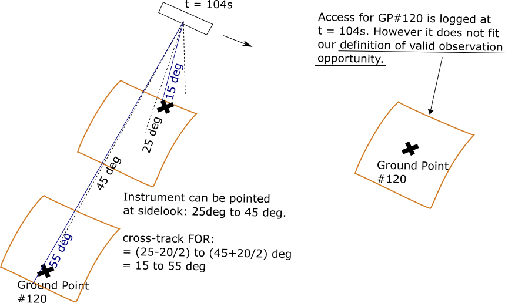

.. OrbitPy documentation master file, created by
   sphinx-quickstart on Tue Feb 11 15:28:03 2020.
   You can adapt this file completely to your liking, but it should at least
   contain the root `toctree` directive.

Welcome to OrbitPy's documentation!
===================================
This package contain set of modules to compute orbit data of satellites. It performs the following functions:

1. Computation of satellite state (position and velocity) data.
2. Generation of grid-of-points at a (user-defined or auto) angular resolution.
3. Computation of Field Of Regard (FOR) based on the manueverability and sensor specifications, mounting.
4. Computation of satellite access intervals over given set of grid points for the length of the mission. 
5. Computation of inter-satellite communication time intervals.
6. Computation of ground-station contact time intervals.

Install
========
Requires: Unix-like operating system (currently tested in Ubuntu 18.04.03), :code:`python 3.8`, :code:`gcc`, :code:`gfortran`

1. Make sure the :code:`instrupy` package (dependency) has been installed. It can be installed by running :code:`make` in the :code:`instruments/instrupy/` directory.
2. Navigate to the :code:`orbits/oc/` directory and run :code:`make`. 
3. Navigate to the :code:`orbits/orbitpy/` directory and run :code:`make`.
4. Execute :code:`make runtest` to run tests and verify *OK* message.
5. Run an example, by running the following command from the :code:`orbits` directory: :code:`python orbitpy/bin/run_mission.py orbitpy/examples/example1/`.
   See the results in the :code:`orbitpy/examples/example1/` folder. Description of the examples in given in :ref:`examples` page. 

Find the documentation in: :code:`/orbitpy/docs/_build/html/index.html#`

.. toctree::
   :maxdepth: 2
   :caption: Contents:

   user_json_desc
   output_desc
   api_reference
   examples
   miscellaneous

Issues
========

Issue #1
^^^^^^^^

Current implementation works well only for:
   1. Instruments whose required observation time < propagation step-size (i.e. < 1s).  
   2. Whose FOV << FOR.

*First one is not realistic if the minimum exposure/ dwell time of instruments 
(required in radiometers) is to be considered. Second one is not realistic assumption for 
instruments having a wide-swath. *

The access file generated by the orbit and coverage is quite naive. It indicates if the ground-point can be accessed at some instant of time.
However, what we require are the imaging oppourtunities, where a imaging opportunity is defined as:

*Outlier grid-points:* The area around the grid-point should be able to be observed, not just the point. Not realistic for instruments with large FOV.

    Issue of the outlier grid-points

Issue #2
^^^^^^^^^^^^
* The area around the ground-point is not the same at each observation, especially for rectangular FOV sensors.

.. figure:: different_observation_areas.png
    :scale: 75 %
    :align: center

    Issue of the different observation areas.

Indices and tables
==================

* :ref:`genindex`
* :ref:`modindex`
* :ref:`search`

Questions?
==========
Please contact Vinay (vinay.ravindra@nasa.gov)