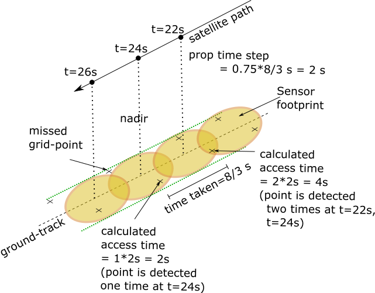
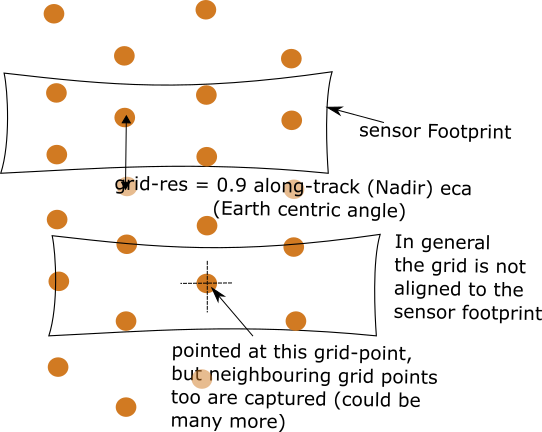

Miscellaneous
**************

.. _prop_time_step_determination:

Propagation time-step determination
======================================
The propagation time step is selected based on the time taken to cover the length (along-track) of the sensor footprint (calculated 
at the nadir) and a time-resolution factor (:code:`time_res_fac`) which be default is set to 0.25. Smaller :code:`time_res_fac` implies higher precision
in calculation of the access interval over a grid-point. In case of conical sensors there is always a chance that a grid-point
is missed during the access calculations.

    Illustration of possible inaccuracies due to a large time resolution factor.

.. _grid_res_determination:

Grid Resolution determination
================================
The grid resolution is set such that at any given arbitrary time, the sensor footprint captures atleast one grid-point
when the satellite is within the interior of a region. This can be acheived by setting the grid resolution (spacing between
the grid points) to be less than the minimum footprint dimension. A grid resolution factor :code:`grid_res_fac` is defined 
(with default value 0.9) and the grid resolution is computed as (:code:`grid_res_fac` . minimum footprint angular dimension).
For example, in case of rectangular sensor with FOV: 5 deg x 15 deg at an altitude of 500km, the minimum footprint angular dimension 
is the Earth centric angle subtended by the 5 deg side = 0.3922 deg. This gives the grid resolution as 0.3530 deg.

    Illustration of relationship between grid resolution and sensor footprint.

.. _corr_acc_files:

"Correction" of access files for purely side-looking instruments
==================================================================

In case of purely side-looking instruments (eg: SARs executing Stripmap operation mode), the access to a grid-point takes place when the grid-point
is seen with no squint angle. The orbit propagation and coverage calculations takes place for a corresponding *sceneFOV* for the instrument 
(see :code:`instrupy` package documentation) which results in long access intervals over a grid-point. The access files are then "corrected"
to show access only at approximately the middle of the access interval. For example if the access data has been registered at t = 104s, 106s, 108s, 110s
(with the propagation time-step as 2 seconds), the times between and including 104s and 110s is treated as a access interval and the corrected
access data shall show access only at t=108s.   
