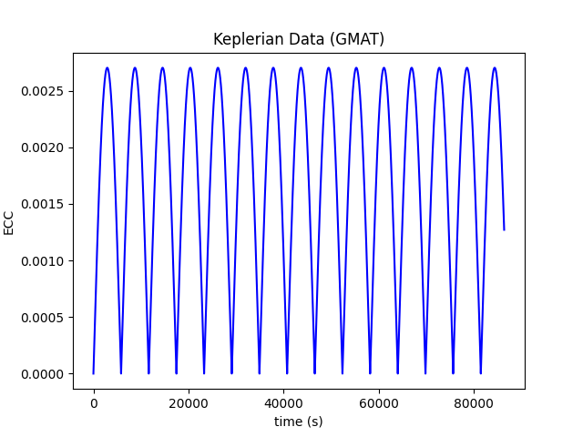

Tests
******

How to
======

Testing is done using the :mod:`unittest` module and :mod:`nose` module. Use the below command to run all the tests:

.. code-block:: shell

        make runtest

Testing strategies
==================

1. Test the expected format of the output files.
2. Use of random input values and calculated output values to validate the test.
       
        i.  Sometimes special cases are run, and some input values which do not make a difference to the 
            output are made random. Eg: In case of a equatorial orbit, the latitude of the location seen by
            a nadir-pointed sensor will always be 0 deg, irrespective of the chosen orbital altitude, raan, ta
            which can be used as random values.
        ii. In cases where the random input values do influence the output, the expected output is calculated 
            (as much as possible) from methods, code other than used by the :code:`OrbitPy` package. Sometimes
            the chosen validation methods are approximate in which case an *approximately equal to* assertion tests
            are used.
3. Using known inputs, and outputs from external sources (eg: literature, other orbital simulation softwares such as GMAT, STK)
4. Run tests after making any revisions to the code. This helps to check that the revisions do not have uninteded effects on the results.

GMAT/STK Modelling Strategies
=============================

GMAT Model
^^^^^^^^^^

The propagation model was tested against GMAT's orbit propagation capabilities. GMAT's propagation settings were fine-tuned to match
OrbitPy's capabilities as much as possible. This included using the eq2000 frame for propagation and output, limiting the gravity model
to only consideration of degree 2, order 0 perturbations (J2 only), changing the earth radius value to exactly match OrbitPy's, and
setting the min/max step size on the numerical propagator to 1 second, among other settings. A full list of general settings used can
be found in the template file.

Due to certain unresolvable differences between GMAT and OrbitPy, it is impossible to match the outputs exactly. In particular, it is important
to note that GMAT uses a numerical propagator, while OrbitPy uses an analytical model. OrbitPy's analytical model considers only secular
J2 perturbations, while GMAT considers all J2 (periodic and secular) perturbations. This is likely the biggest cause of difference between
the two outputs.

GMAT Example Plots
^^^^^^^^^^^^^^^^^^

The example plots below clearly illustrate the modelling differences between GMAT and OrbitPy. The results for the first test case (a 7000 km equatorial circular orbit) 
expressed in cartesian coordinates show divergence.

.. figure:: ./plots/GMAT_01_X_Diff.png
	:scale: 75%
	:align: center

Notably, the Z position also diverges. An inclination is introduced in the GMAT propagation that remains at zero in the OrbitPy propagation. This is due to a periodic perturbation in inclination modeled in GMAT, but taken as zero in OrbitPy.

.. figure:: ./plots/GMAT_01_Z_Diff.png
	:scale: 75%
	:align: center

These additional periodic perturbations in the GMAT model can be more clearly seen when examining the keplerian elements. In particular, the semi-major axis, eccentricity, and inclination are subject to periodic purturbations not present in OrbitPy (for this OrbitPy test case, these values remained at zero throughout the simulation).

.. figure:: ./plots/GMAT_01_SMA.png
	:scale: 75%
	:align: center

.. figure:: ./plots/GMAT_01_INC.png
	:scale: 75%
	:align: center

STK Model
^^^^^^^^^

Further propagation module tests were performed against STK results. STK was expected to match much more closely with GMAT, because STK has the option of using an analytical propagator which considers only secular perturbations in J2, just like OrbitPy. As with GMAT, the STK settings were matched as closely as possible with OrbitPy. The STK file used to produce the data can be found here.

The STK test cases resulted in a much smaller difference than GMAT. Remaining differences are likely explained by a variety of small factors, such as floating point error and slight modelling differences such as the exact values of the gravity coefficients, etc. 

STK Example Plots
^^^^^^^^^^^^^^^^^

The results from the first test case, this time with STK data, are shown again below.

.. figure:: ./plots/STK_01_X_Diff.png
	:scale: 75%
	:align: center

A difference in the Z positions is still introduced, although it is substantially smaller. For an unknown reason, the STK propagation also introduces a small inclination, although much less than GMAT.

.. figure:: ./plots/STK_01_Z_Diff.png
	:scale: 75%
	:align: center

The difference in the semi-major axis, eccentricity, and inclination are plotted below. The semi-major axis and inclination difference plots both exibit very small, random error, while the inclination parts shows a slightly larger, linearly increasing difference.

.. figure:: ./plots/STK_01_SMA_Diff.png
	:scale: 75%
	:align: center

.. figure:: ./plots/STK_01_ECC_Diff.png
	:scale: 75%
	:align: center

.. figure:: ./plots/STK_01_INC_Diff.png
	:scale: 75%
	:align: center

Test Modules
============

:class:`test_OrbitPropCovGrid_1`
^^^^^^^^^^^^^^^^^^^^^^^^^^^^^^^^

.. automodule:: test_OrbitPropCovGrid_1
   :members:

:class:`test_OrbitPropCovGrid_2`
^^^^^^^^^^^^^^^^^^^^^^^^^^^^^^^^

.. automodule:: test_OrbitPropCovGrid_2
   :members:

:class:`test_OrbitPropCovGrid_3`
^^^^^^^^^^^^^^^^^^^^^^^^^^^^^^^^

.. automodule:: test_OrbitPropCovGrid_3
   :members:

:class:`test_STK_propagation`
^^^^^^^^^^^^^^^^^^^^^^^^^^^^^^^^

.. automodule:: test_STK_propagation
   :members:

:class:`test_OrbitPropCovPopts_1`
^^^^^^^^^^^^^^^^^^^^^^^^^^^^^^^^^

.. automodule:: test_OrbitPropCovPopts_1
   :members:

:class:`test_OrbitPropCovPopts_2`
^^^^^^^^^^^^^^^^^^^^^^^^^^^^^^^^^

.. automodule:: test_OrbitPropCovPopts_2
   :members:

:class:`test_GroundStationComm`
^^^^^^^^^^^^^^^^^^^^^^^^^^^^^^^^^

.. automodule:: test_GroundStationComm
   :members:

:class:`test_InterSatelliteComm`
^^^^^^^^^^^^^^^^^^^^^^^^^^^^^^^^^

.. automodule:: test_InterSatelliteComm
   :members:

:class:`test_PreProcess`
^^^^^^^^^^^^^^^^^^^^^^^^^^^^^^^^^

.. automodule:: test_PreProcess
   :members:
